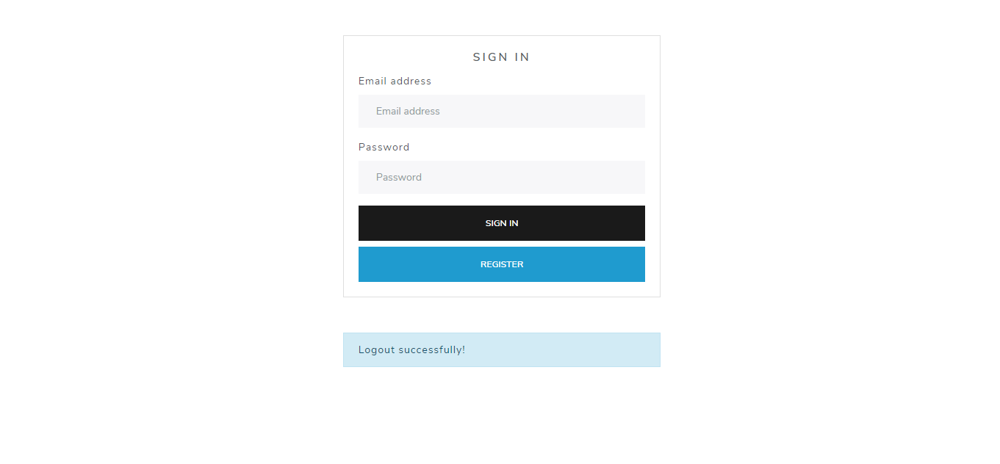
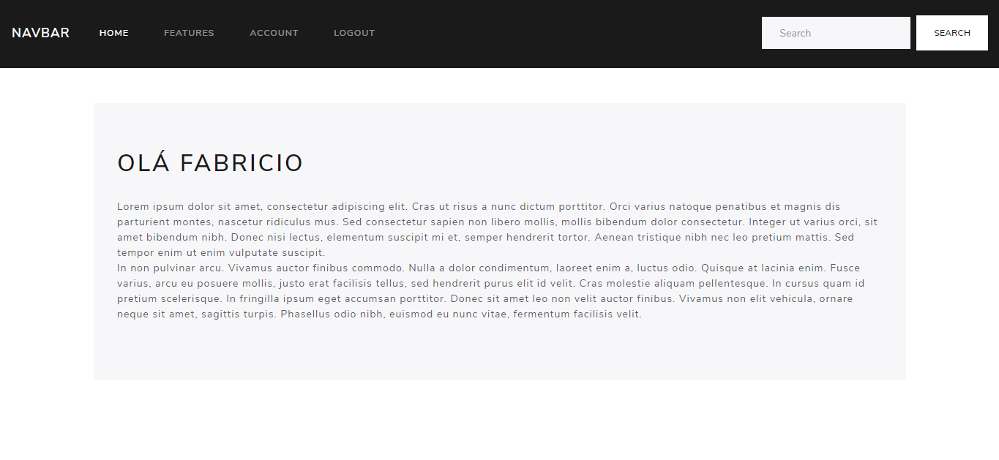

## Overview 
<div>
 
 
</div>

## About 
This project was developed to study and understand the basic concepts of authentication and sessions in PHP.

## Technologies 
This project was built with:
- [Bootswatch: Lux](https://bootswatch.com/lux/#top)
 
## Contribute
 1. Fork this repository;
 2. Create a branch with your feature: ```git checkout -b my-feature```
 3. Commit your changes: ```git commit -m 'feat: My new feature'```
 4. Push your branch: ```git push origin my-feature```
 
## License
This project is under the MIT license. Take a look at the [LICENSE](LICENSE.md) file for more details.

